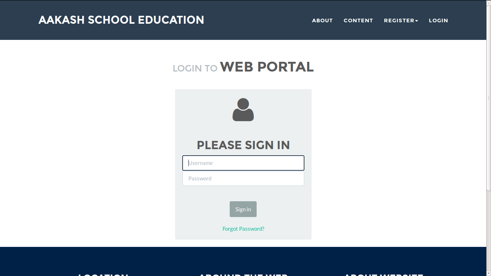

User's guide
============

Introduction
------------

Brief introduction about the project and why it was important to create a
web app.

* Why Python-Django

  Talk about Python programming language and Python web framework:
  Django. Talk about advantage of using python over other programming languages.

* GIT

  Tell why you used GIT to manage this project. Also talk about other
  version control software.

* GNU/Linux

  Talk about GNU, Linux, and Open source. Also mention other linux
  distros and describe Ubuntu.

Description
-----------

Here you will describe your project's workflow like how the different
sections(Books, Contributor, Reviewer) are divided and why. Basically
you will talk about models buy in layman term. This should be
understood by any non-technical user. This section should consume
about 70% of the user-guide.

Workflow
~~~~~~~~

Describe models(in layman terms)

Interface
~~~~~~~~~

Explain each page in detail with screen-shots.

Example:

   Login page

Conclusion
----------

Give good reasons on how your app/project is going to benefit Aakash
project, students, teachers and general public

Reference
---------

List of reference like books, links you used.
